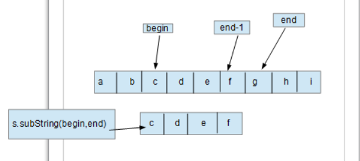
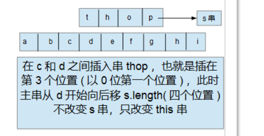

# 字符串

[TOC]

## String类的介绍

* String字符串是一个类，属于引用数据类型
* String在java中重载了'='赋值运算符和'+'、'+='连接运算符
* String类是final修饰的，是最终类，不能被继承
* String类采用字符数组存储字符序列，并且字符数组是最终变量，这表示value的初始化之后的引用不能再指向其他数组，String内部也没有提供改变value指向的数组的方法，所以String不可变


## 模拟String常量字符串

```java
public final class MyString implements Comparable<MyString> {

    //私有字符变量，只能一次赋值
    private final char[] value;

    public MyString() {
        this.value = new char[0];
    }
    
    //字符串常量构造串
    public MyString(String s) {
        this.value = new char[s.length()];
        for (int i = 0; i < s.length(); i++) {
            value[i] = s.charAt(i);
        }
    }
    
    //以value字符的i开头的n个字符串构造串  i <= value.length < n
    //检查i和n的边界，超过value的长度抛出异常
    public MyString(char[] value, int i, int n) {
        if (i >= 0 && n >=0 && i+n <= value.length) {
            this.value = new char[n];
            for (int j = 0; j < n; j++) {
                this.value[j] = value[j+i];
            }
        } else {
            throw new IndexOutOfBoundsException("i = " + i + ", n = " + n);
        }
    }
    
    //一整个字符数组构造串
    public MyString(char[] value) {
        this.value = new char[value.length];
        for (int i = 0; i < value.length; i++) {
            this.value[i] = value[i];
        }
    }
    
    public int length(){
        return this.value.length;
    }
    
    public char charAt(int i) {
        if (i >=0 && i < this.length()) {
            return this.value[i];
        } else {
            throw new IndexOutOfBoundsException("i = " + i);
        }
    }

    //compareTo方法，首先遍历传进来的字符串和自身字符串，返回两串第一个不同字符的差值
    //如果不存在不同字符，也就是互为子串、或是其中一个串为另一个串的子串，返回两个字符串的长度差值
    @Override
    public int compareTo(MyString myString) {

        for (int i = 0; i < this.value.length && i < myString.length(); i++) {
            if (this.value[i] != myString.value[i]) {
                return this.value[i] - myString.value[i];
            }
        }
        return this.value.length - myString.length();
    }
}
```

### 求String类的子串

​	将父串s从序号的begin值end-1组成的子串组成另一个串返回，不改变s父串。如图所示：




```java
public MyString subString(int begin, int end) {

        if (begin >= 0 && end >= 0 && begin + end <= this.value.length) {
            return new MyString(this.value,begin,end);//new一个新的对象，不改变this和myString
        } else {
            throw new IndexOutOfBoundsException();
        }
    }
```


### 连接两个串

​		返回this和传进来的字符串的连接串，并且不改变this和传进来的字符串

```java
    public MyString concat(MyString s) {
        
        if (s == null || s.equals("")) {
            //深拷贝。new一个新对象
            return new MyString(this.value);
        }
        char[] buff = new char[this.value.length + s.length()];
        int i;
        //拷贝this字符串
        for (i = 0; i < this.value.length; i++) {
            buff[i] = this.value[i];
        }
        //拷贝s字符串
        for (int j = 0; j < s.length(); j++) {
            buff[i+j] = s.value[j];
        }
        //调用构造器，返回连接字符串
        return new MyString(buff);
    }
```


## StringBuffer类的介绍

​	由于String类存储常量字符串，一旦创建出实例，就不能修改它，这是线程安全的。但是每次连接或者是重新赋值运算都会创建新的实例，这会增加空间的使用和运算的效率。因此java还声明StringBuffer类，采用缓冲区存储可变长的字符串，避免频繁的申请内存，


​	StringBuffer类的特点

* StringBuffer类是最终类，不能被继承
* StringBuffer类以变量串方式存储和实现字符串操作
* StringBuffer类的插入，删除等方法是线程互斥的，不能并行交替的进行修改，否则将会产生与时间有关的错误


```java
public final class MyStringBuffer{

    private char[] value;
    private int n;//记录数组长度

    public MyStringBuffer(int capacity) {
        value = new char[capacity];
        this.n = 0;
    }

    public MyStringBuffer(){
        this(16);
    }
    //以字符串常量构造串
    public MyStringBuffer(String s) {
        //调用构造器
        this(s.length() + 16);
        this.n = s.length();
        for (int i = 0; i < this.n; i++) {
            this.value[i] = s.charAt(i);
        }
    }
    //返回数组的元素个数，也就是字符串个数
    public int length() {
        return this.n;
    }
    //返回数组的长度
    public int capacity() {
        return this.value.length;
    }
    //以value数组从0到n构造字符串
    public synchronized String toString() {
        return new String(this.value, 0, this.n);
    }
    //返回地i个字符
    public synchronized char charAt(int i) {
        if (i >= 0 && i < this.n) {
            return this.value[i];
        } else {
            throw new IndexOutOfBoundsException("i = " + i);
        }
    }
    //设置第i个字符为c
    public synchronized void setCharAt(int i, char c) {
        if (i >= 0 && i < this.n) {
            this.value[i] = c;
        } else {
            throw new IndexOutOfBoundsException("i = " + i);
        }
    }

}
```


### stringBuffer插入串

​	在this串第i个位置插入串s，如图所示



* 如果this串的数组容量不够，需要再申请一个更大容量的字符数组，并复制this串的原字符数组

```java
public synchronized MyStringBuffer insert(int i, String s) {

        //只能从第一位到最后一位插
        if (i >= 0 && i <= this.n) {
            if (s == null) {
                s = "";//s为空，按照空串处理
            }
            char[] temp = value;
            //如果数组的长度不够两个串加起来的长度，需要扩容
            if (this.value.length < this.n + s.length()) {
                this.value = new char[(this.n + s.length()) * 2];//两倍于两串加起来之和
                for (int j = 0; j < i; j++) {//value需要重新赋值
                    value[i] = temp[i];
                }
            }
            //由于temp和value指向同一个数组，从最后一个字符开始向后移动s.length()，一直到第i个字符
            for (int j = this.n - 1; j >= i; j--) {
                value[j+s.length()] = temp[j];
            }
            //插入s串
            for (int j = 0; j < s.length(); j++) {
                value[j+i] = s.charAt(j); 
            }
            //更新n的长度
            this.n = n + s.length();
            return this;
        }else {
            throw new IndexOutOfBoundsException("i=" + i);
        }
    }

    //从尾部连接s串
    public synchronized MyStringBuffer append(String s) {
        return this.insert(this.n, s);
    }
```


### 删除子串

```java
//删除begin到end-1之间的子串
    public synchronized MyStringBuffer delete(int begin, int end) {
        
        if (begin >= 0 && begin < this.n && end >= 0 && begin <= end) {
            //end长度容错
            if (end > this.n) {
                end = this.n;
            }
            //将 end开始之后的子串复制到前面，但end之后的子串并没有去掉
            for (int i = 0; i < n - end; i++) {
                this.value[i+begin] = this.value[end + i];
            }
            //刷新n的长度
            this.n = n - (end - begin);
            return this;
        }
        else {
            throw new IndexOutOfBoundsException();
        }
    }
```

 

