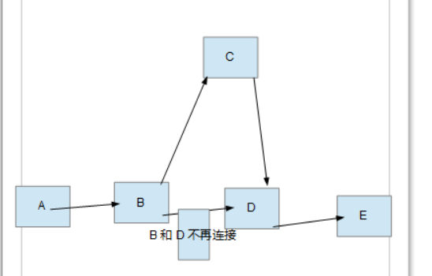
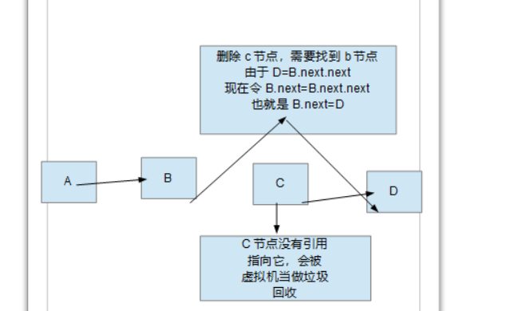
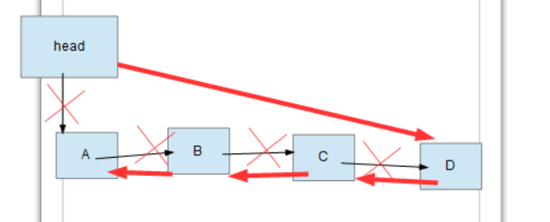
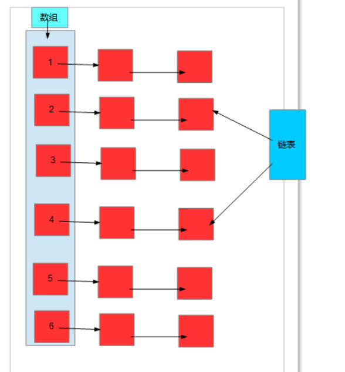

# 线性表

## 顺序存储结构


> ​	我们都知道数组创建出来之后，其容量和地址就是确定的，我们只能对数组进行取值和赋值的操作。不能进行插入、删除操作。也不能就地扩容，有着很多限制。因此顺序表就此衍生，它是数组的plus版本，是基于数组来实现的。
>
> ​	顺序表内部有着一个数组成员变量element，用于存储元素；还有一个整形变量n，用于记录整个顺序表元素个数。
>
> ​	顺序表可以实现增加，删除，添加，查询元素的功能。而这些功能都是基于操作成员变量element来实现的，也就是操作数组实现的，说了这么多，总的实现才行。
>
> ​	首先建立一个ArrayList类，根据上面的分析，我们知道他有两个成员变量
>
> ```java
> class ArrayList<T>{ //定义泛型，可以接受任何一种数据类型的元素存储
>     
>     private int n;//记录整个元素的个数
>     private Object[] element;//底层数组变量，用于存储元素
>     private static final int MIN_CAPACITY = 16;//数组的初始长度
>     
>     public ArrayList(){
>         this.element = new Object[MIN_CAPACITY];//直接初始化数组
>         this.n = 0;//目前还未添加元素。令n=0
>     }
>     
>     public boolean isEmpty(){
>         return this.n == 0;
>     }
>     
>     //遍历顺序表
>     public String toString(){
> 
>         String str = "ArrayList[ ";
>         for (int i = 0; i < this.n; i++) {
>             str += this.element[i].toString() + ","; //利用元素自己的toString方法
>         }
>         return str + " ]";
>     }
>    
> }
> ```
>
> ​	
>
> ​	然后就是对线性表编写增删改查的功能了，首先就是增加元素的功能
>
> ​	可以分析以下，增加一个obj元素，就是令**element[n] = obj**;并且**n++**；这样就可以增加元素了，当我们一直增加就会出现一种情况--**n=element.length**--代表数组已经满了，这个时候就需要扩容了。代码走起来
>
> ```java
> public void add(T t){
>     
>     if (t == null){
>         return;//传入的值不能是null，不然加个屁
>     }
>     if (this.n == element.length) {
>         Object[] temp = this.element;//此时temp和element指向同一个数组
>         //对element进行扩容，申请一个2倍于之前的数组空间
>         element = new Object[2 * temp.length];
>         //将temp的数据复制
>         for (int i = 0; i < temp.length; i++) {
>             element[i] = temp[i];
>         }
>     }
>     element[this.n] = t;
>     this.n++;
> }
> ```
>
> ​	可以编写一个测试程序
>
> ```java
> public static void main(String[] args) {
>         ArrayList<String> arrayList = new ArrayList<String>();
>         arrayList.add("A");
>         arrayList.add("B");
>         arrayList.add("C");
> 
>         System.out.println(arrayList.toString());
>     }
> 输出结果：
>     ArrayList[ A,B,C, ]//逗号可以自己优化一下toString
> ```
>
> ​	
>
> ​	当然，现在只是完成了在最后面添加元素，看起来挺low的，现在我们来分析如何在数组上插入元素。
>
> ​	首先肯定是要传入一个下标的参数，这样我们才知道往哪里插...拿到这个下标之后，首先就是让下标后面的元素给我往后移，腾个地，这样我们才能插入到这个位置，代码实现：
>
> ```java
> public void insert(int i, T t) {
>     if (t == null){
>             return;
>     }
>     if (i > element.length) {
>        i = this.n;//i肯定是不能让他超过数组的容量的，不然插个鬼
>     }
>     if (i < 0){
>        i = 0;//同理，i不能小于0
>     }
>     Object[] temp = element;//此时temp和element指向同一个数组
>     if (this.n == element.length) {
>         //对element进行扩容，申请一个2倍于之前的数组空间
>         element = new Object[2 * temp.length];
>         //如果element申请了大的空间，代表数据全没了，i前面的元素需要重新赋值
>     	for (int j = 0; j < i; j++) {
>       	   element[j] = temp[j];
>    	 	}
>     }
>     for (int j = this.n - 1; j >= i; j--) {
>        element[j+1] = temp[j];//由于两个引用是指向同一个数组，只能倒序复制，不然从j开始就全是一样的元素~~
>     }
>     element[i] = t;
>     this.n ++;
> }
> ```
>
> ​	
>
> ​	接下来就是删除某一个元素了，删除一个元素之后，我们需要把删除元素后面的元素前移，并且n--；代码实现：
>
> ```java
> public T remove(int i) {//返回被删除的元素
>     
>     if (i < 0 && i > this.n) {//必须要进行下标检索
>         T temp = (T)this.element[i];//记录被删除的元素
>  		for (int j = i; j < this.n-1; j ++) {
>             this.element[j] = this.element[j+1];//前移可以正序赋值
>         }       
>         element[n-1] = null;
>         this.n --;
>         return temp;
>     }
>     return null;
> }
> ```
>
> ​	
>
> ​	然后就是改元素了
>
> ```java
> public void set(int i, T t) {
>     
>     if (t == null) {
>         throw new NullPointException("x==null");//t为空，抛出x==null的异常
>     }
>     if (i >=0 && i < this.n) {
>         this.element[i] = t;
>     } else {
>         throw new IndexOutOfBoundsException("i=" + i);//抛出数组越界异常
>     }
> }
> ```
>
> ​	
>
> ​	最后就是查了，这是最简单的一个方法了
>
> ```java
> public T get(int i) {
>    
>     if (i >=0 && i < this.n) {
>         return (T)this.element[i];
>     }
>     return null;
> }
> ```
>
> ​	
>
> ​	顺序表还有浅拷贝和深拷贝，所谓浅拷贝就是**两个ArrayList对象中的element引用指向同一个数组对象**，而深拷贝却是**重新new了一个顺序表**，然后对这个新的顺序表进行一一赋值操作。
>
> ```java
> //深拷贝，请忽略element是private
> public ArrayList(ArrayList<T> list) {
>     this.element = new Object[list.element.length];
>     for (int i = 0;i < list.length; i++) {
>         element[i] = list.element[i];
>     }
>     this.n = list.n;
> }
> 
> //浅拷贝
> public ArrayList(ArrayList<T> list) {
>     
>     this.n = list.n;
>     this.element = list.element;
> }   
> ```


## 链式存储结构

> ​	所谓链式存储，就是一个对象**牵着**一个对象，然后形成了一个**链条**，个人觉得链式存储稍微好理解一点，如下图所示
>
> 
>
> ​	
>
> ​	要想实现图中的结构只需要在类中定义一个自身类型的成员变量，用来存储连接的下一个对象的地址即可
>
> ​	代码实现：
>
> ```java
> class Node<T>{
>     
>     T t; //存储具体数据
>     Node next;//自身类型的变量，用于连接下一个对象，相当于指针
>     
>     public Node(T t){
>         this.t = t;
>     }
>     
>     @Override
>     public String toString() {
>         return "Node{" + "t=" + t + '}';
>     }
> }
> 
> class LinkedList<T>{
>     
>     Node<T> head = null; //定义头指针
> 
>     public LinkedList(){
>         this.head = new Node<T>();
>     }
> 
>     public void add(T t){
>         if (t == null){
>             throw new NullPointerException("t=null");
>         }
>         Node<T> node = new Node<>(t);
>         //如果头结点的下一个节点为空
>         if (head.next == null){
>             head.next = node;
>             return;
>         }
>         //head节点不能变，让temp和head同时指向一个对象进项操作
>         Node temp = head;
>         //不然就让temp一直遍历到最后一个节点
>         while (temp.next != null) {
>             temp = temp.next;
>         }
>         temp.next = node;
>     }
>     
>     public String toString(){
>         if (head.next == null){//head没有了连接，直接return null
>             System.out.println("此链表为空");
>             return null;
>         }
>         Node temp = head;
>         String str = "LinkedList[ ";
>         while (temp.next != null) {
>             temp = temp.next;
>             str += temp + ",";
>         }
>         return str + " ]";
>     }
> }
> ```
>
> 
>
> ​	可以写一个测试程序：
>
> ```java
> public static void main(String[] args) {
>         LinkedList<String> linkedList = new LinkedList<String>();
>         linkedList.add("A");
>         linkedList.add("B");
>         linkedList.add("C");
>         System.out.println(linkedList.toString());
>     }
> 测试结果：
>     LinkedList[ Node{t=A},Node{t=B},Node{t=C}, ]
> ```
>
> ​	接下来就是来个高级一点的添加方法了，不是尾部插入了，而是随机插入，想要在一个地方插入节点，那么我们**必须要找到要插入位置的前一个节点**，假设插入的是C节点，此位置的前一个节点是B节点，B节点的下一个节点时D节点，那么我们需要令**C.next=D.next，B.next = C.next**(顺序不能颠倒)，这样才能实现插入添加，所以代码的核心就是插入节点的位置**找到前一个节点**，**这里我们以零表示第一个节点**。
>
> ​	当插入位置是0，我们需要得到头结点；当插入位置是1，我们需要得到A节点；当插入位置是2，我们需要得到B节点...
>
> 
>
> ​	代码实现：
>
> ```java
> public void insert(int i, T t) {
>     //判断t是否为空
>     if (t == null) {
>         throw NullPointerExcepction("x == null");
>     }
>     //判断i的合法性
>     if (i < 0) {
>         i = 0;
>     }
>     if (i > 0) {
>         i = this.size();//i等于此链表的长度
>     }
>     int j = 0;//定义一个整型变量，和传入的下标进行比较
>     Node temp = head;
>     while (temp.next != null) {
>         //当插入位置i是0，我们得到头结点；当插入位置i是1，我们得到A节点；当插入位置i是2，我们得到B节点...
>         if (j == i) {
>             break;
>         }
>         j ++;
>         temp = temp.next;
>     }
>     Node<T> node = new Node<>(t);//将传进来的t转成node节点
>     //当插入位置是最后一个节点时，temp.next为空，所以需要判断
>     if (temp != null) {
>         node.next = temp.next;
>     }
>     temp.next = node;
> }
> 
> public int size(){
>     int i = 0;
>     Node temp = head;
>     whlie (temp.next != null) {
>         temp = temp.next;
>         i ++;
>     }
>     return i;
> }
> ```
>
> ​	测序测试：
>
> ```java
> public static void main(String[] args) {
>         LinkedList<String> linkedList = new LinkedList<String>();
>         linkedList.add("A");
>         linkedList.add("B");
>         linkedList.add("C");
>         System.out.println("没有插入之前" + linkedList.toString());
>         System.out.println("没有插入之前size=" + linkedList.size());
>         linkedList.insert(3,"D");
>         System.out.println("插入之后size=" + linkedList.size());
>         System.out.println("插入之后" + linkedList.toString());
>     }
> 
> 输出结果：
>     没有插入之前LinkedList[ Node{t=A},Node{t=B},Node{t=C}, ]
>     没有插入之前size=3
>     插入之后size=4
>     插入之后LinkedList[ Node{t=A},Node{t=B},Node{t=C},Node{t=D}, ]
> ```
>
> 
>
> ​	接下来就是怎么删除一个给定位置的节点了，想要删除一个节点，那么还是需要找到他的前一个节点
>
> ，令**前一个节点.next = 前一个节点.next.next**，如图所示：
>
> 
>
> ​	代码实现：
>
> ```java
> public T remove(int i) {
>     if (i >= 0 && i < this.size()) {
>         int j = 0;
>         Node temp = head;
>         while (temp.next != null) {
>             if (i == j) {
>                 break;
>             }
>             j ++;
>             temp = temp.next;
>         }
>         T t = (T) temp.t;
>         temp.next = temp.next.next;
>         return t;
>     }
>     return null;
> }
> ```
>
> 
>
> ​	接下来就是改的方法了，改掉一个节点的数据的话，跟删除和插入是有点不一样的，这是就不用了找到前一个节点了，直接找到当前节点就可以进行修改了。直接上代码
>
> ```java
> public void set(int i, T t) {
>     
>     if (t == null ){
>        throw new NullPointerException("t == null");
>     }
>     if (i < 0 || i >= this.size()) {
>        throw new IndexOutOfBoundsException("i = " + i);
>     }
>     int j = 0;
>   	Node temp = head;
>     while (temp.next != null) {
>         temp = temp.next;
>         if (j == i) {
>             break;
>         }
>         j ++;
>     }
>     temp.t = t;
> }
> ```
>
> 
>
> * 链表的反序
>
>   链表的反序的意思是将head节点连到最后一个结点，然后就是第一个节点作为最后一个节点，依次反序...如图所述：
>
>   
>
>   思路分析：
>
>     	首先，实现一个链表反序，肯定是需要遍历所有的节点的，这一点毋庸置疑。假设B节点就是当前我们正在遍历的节点，那么我们需要B.next=A，问题是现在已经遍历到B了，怎么拿到A呢？当遍历到C的时候，又怎么拿到B呢，这个时候我们就需要一个记录当前节点的前一个节点的past节点，可想而知past节点一开始为空，因为A.next=null。于是我们可能有了下面的代码
>
>   ```java
>   Node past = null;
>   A.next = past;
>   past = A;
>   A = A.next;
>   ```
>
>    	这时候问题就来了，一开始A.next = past = null，那么后面A=A.next = null，这就造成了死循环并且很有可能出现空指针异常，所以我们现在的问题是怎么让A = A.next = B，其实解决方案跟前面一样，只要一开始我们就记录下A 的下一个节点，这样就不会造成上面的情况了。代码实现：
>
>   ```java
>   public void reverse(){
>       if (head.next == null) {
>           return;
>       }
>       Node past = null, temp = this.head.next, behind = null;
>       while (temp.next != null) {
>           behind = temp.next;//首先记录下temp的下一个节点
>           temp.next = past;//temp.next等于前一个节点
>           past = temp;//记录当前节点，在下一次循环时使用
>           temp = behind;
>       }
>       //遍历完成后，temp=behind已经是最后一个节点，但因为最后一个节点进不去循环，所以需要手动补充
>       temp.next = past;
>       //令head连接到temp即可
>       this.head.next = temp;
>   }
>   ```
>
>   测试：
>
>   ```java
>    public static void main(String[] args) {
>           LinkedList<String> linkedList = new LinkedList<String>();
>           linkedList.add("A");
>           linkedList.add("B");
>           linkedList.add("C");
>   //        linkedList.remove(2);
>   //        linkedList.set(3,"D");
>           linkedList.reverse();
>           System.out.println(linkedList);
>       }
>   
>   结果：
>       LinkedList[ Node{t=C},Node{t=B},Node{t=A}, ]
>   ```
>
>   
>
>   ## 应用-哈希表
>
>   ​	其实学习了链表之后，可以尝试的做一下一个简陋的哈希表，巩固一下知识，哈希表是**一个便于检索数据结构，可以根据key值来查到数据。**哈希表有两种方式实现：
>
>   * 数组+链表
>   * 数组+二叉树
>
>   ​    那这里肯定是用数组+链表的方式来实现了，那说到底怎么才能实现呢，哈希表又长什么样子呢？
>
>   
>
>   这就是哈希表的简陋图解了，看到这个图是不是已经有点思路了呢，只要我们弄出一个链表类型的数组就可以实现这样的结构了，接下来就是代码环节了。这次就不适用泛型了，我们编写一个快速查找员工id的哈希表
>
>   ```java
>   class Emp{
>   
>       int id;
>       String name;
>       Emp next;
>   
>       public Emp() {
>   
>       }
>   
>       public Emp(int id, String name) {
>           this.id = id;
>           this.name = name;
>       }
>   
>       @Override
>       public String toString() {
>           return "Emp{" +
>                   "id=" + id +
>                   ", name='" + name + '\'' +
>                   '}';
>       }
>   }
>   
>   class EmpLinkedList{
>       Emp head = null;
>   
>       public void add(Emp emp){
>   
>           if (emp == null){
>               throw new NullPointerException("t=null");
>           }
>           //这里头结点不再不存储数据了，头结点也要对其赋值
>           if (head == null){
>               head = emp;
>               return;
>           }
>           //head节点不能变，让temp和head同时指向一个对象进项操作
>           Emp temp = head;
>           //不然就让temp一直遍历到最后一个节点
>           while (temp.next != null) {
>               temp = temp.next;
>           }
>           temp.next = emp;
>       }
>   
>       public String toString(){
>           if (head == null){
>               return null;
>           }
>           Emp temp = head;
>           String str = "LinkedList[ ";
>           str += head;
>           while (temp.next != null) {
>   
>               temp = temp.next;
>               str += "," + temp;
>           }
>           return str + " ]";
>       }
>   }
>   
>   class HashTab<T>{
>   
>       EmpLinkedList[] empLinkedLists;
>       int size;
>       public HashTab(int size) {
>           this.size = size;
>           //初始化链表数组
>           empLinkedLists = new EmpLinkedList[size];
>           //必须将每个链表都要实例化！！！
>           for (int i = 0; i < size; i++) {
>               empLinkedLists[i] = new EmpLinkedList();
>           }
>       }
>   
>       //写一个简单的散列函数，根据数组大小取余，这样得到的值就会在（ 0 - (size-1)）之间，方便进行检索
>       public int getNum(int id) {
>           return id % size;
>       }
>   
>       public void add(Emp emp) {
>           if (emp == null) {
>               return;
>           }
>           //获取在哪一条链表上添加
>           int num = getNum(emp.id);
>           empLinkedLists[num].add(emp);
>       }
>   
>       public void show(){
>           for (int i = 0; i < empLinkedLists.length; i++) {
>               System.out.println("第" + i + "条链表为" + empLinkedLists[i]);
>           }
>       }
>   }
>   ```
>
>   测试：
>
>   ```java
>   public static void main(String[] args) {
>   
>           HashTab hashTab = new HashTab(8);
>           Emp bob = new Emp(1, "bob");
>           Emp alan = new Emp(2, "alan");
>           Emp siy = new Emp(123, "alan");
>           Emp pok = new Emp(569, "alan");
>           hashTab.add(bob);
>           hashTab.add(alan);
>           hashTab.add(siy);
>           hashTab.add(pok);
>           hashTab.show();
>       }
>   
>   输出结果：
>       第0条链表为null
>       第1条链表为LinkedList[ Emp{id=1, name='bob'},Emp{id=569, name='alan'} ]
>       第2条链表为LinkedList[ Emp{id=2, name='alan'} ]
>       第3条链表为LinkedList[ Emp{id=123, name='alan'} ]
>       第4条链表为null
>       第5条链表为null
>       第6条链表为null
>       第7条链表为null
>   ```
>
>   
>
>   相信到了这一步查找方法已经是很好些啦把
>
>   ```java
>   public Emp search(int id) {
>           int num = getNum(id);//获取在那一条链表查询
>           Emp temp = empLinkedLists[num].head;
>           while (temp != null) {
>               if (temp.id == id) {
>                   break;
>               }
>               temp = temp.next;
>           }
>           if (temp == null){
>               System.out.println("没有此员工！");
>           }
>           return temp;
>       }
>   ```
>
>   测试：
>
>   ```java
>   public static void main(String[] args) {
>   
>           HashTab hashTab = new HashTab(8);
>           Emp bob = new Emp(1, "bob");
>           Emp alan = new Emp(2, "alan");
>           Emp siy = new Emp(123, "alan");
>           Emp pok = new Emp(569, "alan");
>           hashTab.add(bob);
>           hashTab.add(alan);
>           hashTab.add(siy);
>           hashTab.add(pok);
>           Emp search = hashTab.search(123);
>           System.out.println(search);
>           Emp noEmp = hashTab.search(12);
>           System.out.println(noEmp);
>       }
>   输出结果：
>       Emp{id=123, name='alan'}
>       没有此员工！
>       null
>   ```
>
>   

